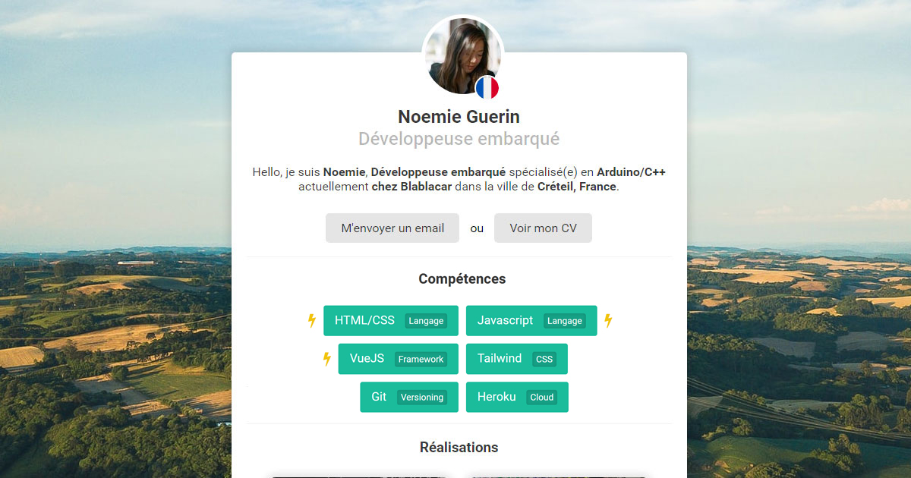

# John Doe
John Doe is a minimalist personal website template made for developers built using only plain html, css and javascript.

Live demo is available here: [https://nicolasbrondin.github.io/john-doe/index.html](https://nicolasbrondin.github.io/john-doe/index.html)

